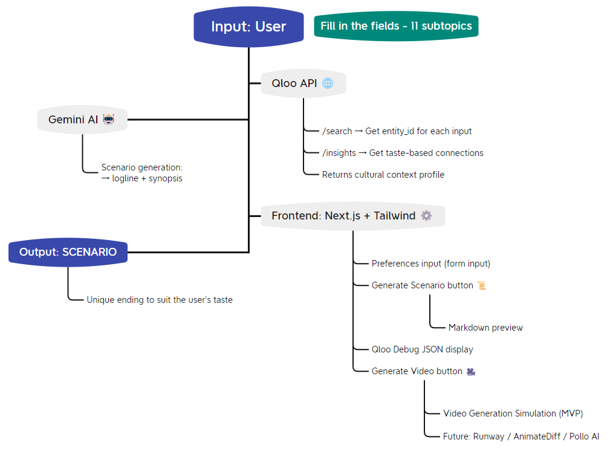

# ⚡️ ApoShorts AI — Apocalypse by Taste
  

What if your tastes could predict the end of the world?

**ApoShorts AI** is an AI-powered recommendation engine that crafts short cinematic experiences based on what you love — books, brands, video games, TV shows, artists, etc. It pulls insights from your favorites and turns them into personalized apocalypse scenarios. Because the world might end — but it’ll end in style. 💥

Created for [Qloo LLM Hackathon](https://devpost.com/software/aposhorts-ai).


## 🚀 How it works

1. **You Tell What You Love**
- Drop your faves: albums, books, brands, podcasts, destinations, games... anything.
2. **Qloo Knows Your Soul**
- Uses the [Qloo API](https://qloo.com) to find deep cultural connections based on your tastes.
3. **Gemini Imagines the Apocalypse**
- Passes everything to **Google Gemini** (yes, the AI), and it scripts a mini-movie — a custom apocalypse just for you.
4. **Boom. You Get a Narrative**
- A short text output that feels like a trailer to a movie that doesn’t exist. Yet. 👀
5. **Short Video Demo**
- For the MVP demo, a sample cinematic video is used to simulate the video generation process.

> Services like Runway, Haiper AI (Pollo), and Replicate/AnimateDiff were evaluated and documented in the repo, but all required paid credits or API limitations.

## 🗺️ Architecture Overview

Below is a high-level architecture flow of how user input flows through the system, from cultural insights to generative storytelling:



## 🧠 Built With

- ⚙️ **Next.js (App Router)**
- 🌐 **Qloo API v2** — for entity insights
- 🤖 **Google Gemini** — for generative storytelling
- 🧪 **Tailwind CSS** — for styling that's fast, clean, and fun
- 🔐 `.env` — for your secret API keys, duh


## 🧨 Example Prompt

> **You like:**  
> 🎮 Counter-Strike  
> 🎧 This American Life  
> 📚 1984  
> 👟 Nike

> **Your apocalypse:**  
> _"As digital soldiers glitch through VR battlefields, a voice from This American Life repeats Orwellian headlines. The last survivors wear Nike and watch the world burn — fashionably."_

Yeah. It’s that weird. And that good.


## 🔍 Use Case

ApoShorts AI could power:
- Personalized intros for streaming platforms
- Cultural moodboards for creative teams
- Taste-driven short-form content for entertainment marketing


## 💾 Local Dev

1. Install dependencies:
```bash
git clone https://github.com/your-username/aposhorts-ai.git
cd aposhorts-ai
npm install
```

2. Set up your `.env` file: `QLOO_API_KEY`,  `GEMINI_API_KEY`.

3. Start it up:
```bash
npm run dev
```


## 💡 Why This Project?

ApoShorts AI leverages **Qloo’s cultural graph** and **Google Gemini's generative intelligence** to craft personalized narratives. This approach transforms traditional recommendations, moving beyond basic filtering to create emotionally resonant and unique storytelling experiences based on individual tastes in music, films, brands, and more.

I believe in exploring the creative potential of AI to deliver engaging and memorable content.


## 📍 License

This project is open-sourced under the MIT License. Feel free to explore, modify, and build upon this foundation for your own creative endeavors.